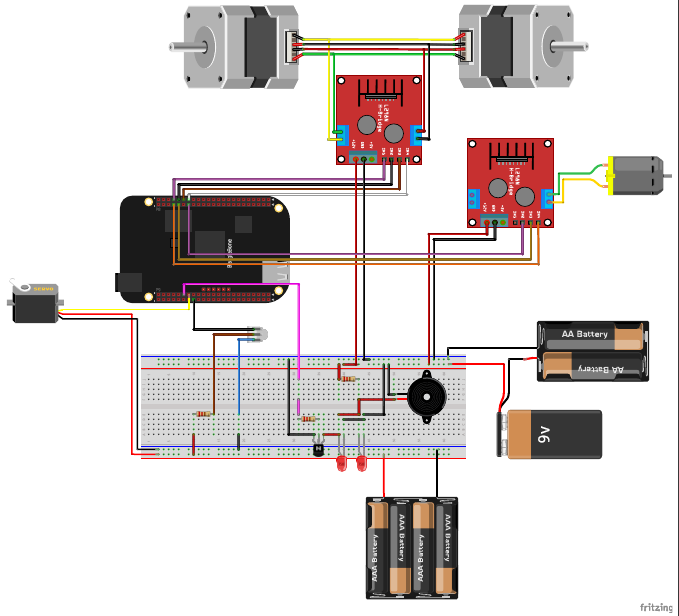

                
# Projeto de Sistemas Embarcados: Simulação de controle de acesso de uma ponte levadiça, utilizando a placa BeagleBone Black

Nosso projeto busca simular o funcionamento de uma ponte levadiça através de um protótipo que consiste de uma miniaturização e simplificação de um modelo real. Para conseguir isso, estudamos as principais características do funcionamento real do modelo, ou seja, o levantamento, a descida, e como o tráfego terrestre influencia na sua resposta.

O sistema é regido pela saída do sensor de presença do tipo reflexivo. O sensor emite um feixe infravermelho; quando há presença, este feixe é refletido para o sensor, que responde com sinal lógico indicativo de obstáculo ou não. Em caso de detecção a BeagleBone inicia o acionamento do sistema.

Durante o levantamento, é de extrema importância garantir a ausência total de carros, portanto, utilizamos sistemas sinalizadores com um buzzer sonoro e LEDs piscando para avisar que a ponte irá levantar. Então aguarda-se um período de tempo para permitir a saída dos carros ainda presentes durante o alarme. As cancelas controladas pelo servomotor e motor DC abaixam-se para impedir um novo fluxo de veículos e após isso a ponte inicia o movimento para abrir.

A ponte fica aberta até que o sensor nos informe que não há mais presença de embarcações. Sendo assim,  é seguro que a ponte inicie o movimento para fechar. Para isso, invertemos o sentido de rotação dos motores, fazendo com que a ponte se feche, e após isso, abrem-se as cancelas, e repete-se o processo, aguardando por novos sinais de presença.

# Descrição

Este README.md tem como função servir de guia para o projeto de um sistema de ponte levadiça, de construção ao código de controle. O protótipo foi construído com madeira, formado por duas bases cúbicas, que servem de suporte para a ponte. A ponte em si consiste de dois retângulos de pouca espessura, também em madeira, em cujas extremidades se encontram parafusadas dobradiças, permitindo o movimento relativo entre os retângulos e a base, e simulando uma ponte em pequena escala. O torque é passado para as dobradiças via um barbante, acoplado na ponte com um furo, e enrolado no eixo de um motor de passo, que se encontra por cima de uma base também de madeira.  Além disso, encontra-se acoplado um sensor de presença, que será utilizado para detectar embarcações e orquestrar o movimento da ponte. Todos estes detalhes de construção podem ser melhor entendidos observando a foto abaixo:


# Lista de componentes usados

* 1 Motor DC ([Datasheet](http://www.e-jpc.com/pdf/dcmotors601-0241.pdf))
* 1 Servomotor Tower Pro MG995 ([Datasheet](https://www.electronicoscaldas.com/datasheet/MG995_Tower-Pro.pdf))
* 2 Motores de passo ([Datasheet](https://www.circuitspecialists.com/products/pdf/57BYGH207.pdf))
* 3 Protoboards
* 2 LEDs
* 1 Sensor de presença reflexivo ([Datasheet](http://www.ett.co.th/productSensor/E18-D80NK/Manual_IR-Sensor%20Switch%20E18.pdf))
* 1 Beaglebone Black Rev C com Debian 9.5 2018-10-07 4GB SD IoT instalado
* 2 Driver L298N ([Datasheet](https://www.sparkfun.com/datasheets/Robotics/L298_H_Bridge.pdf))
* 1 Transistor para controle de corrente ([Datasheet](http://www.farnell.com/datasheets/661741.pdf))
* Jumpers



# Código Fonte

De início, pensamos em utilizar a linguagem C++ para controle dos pinos da BeagleBone. Como o acesso I/O à placa é feito via arquivos, a construção do setup básico tornou-se extremamente verbosa e maçante. Migramos, então, para a linguagem Python utilizando a biblitoteca Adafruit que provê um novo layout de abstração para a escrita de código, podendo reduzir os esforços referentes ao setup, e concentrá-los no desenvolvimento da lógica da ponte.

O código utilizado para controle é escrito em python, não necessitando de toolchain para geração de código de máquina, já que trata-se de uma linguagem interpretada, cujo interpretador é software default de distribuições linux, das quais o Debian, sistema operacional instalado na BeagleBone, faz parte.

Para execução deste código, basta clonar este repositório, abrir um terminal, e executar os seguintes comandos dentro da pasta em que ele se encontra:

```ssh 192.168.7.2 -l root```. Com isso, é solicitada ao usuário a senha para realizar a conexão. A senha padrão é ```temppwd```. Feito isso, estamos conectados ao terminal da placa. Devemos abrir outro terminal agora, navegar novamente para a pasta do repositório e executar: ```scp ponte.py debian@192.168.7.2:/home/debian/``` e retornando ao terminal conectado à placa, basta rodar com ```python ponte.py``` e o programa começará a execução.

Detalhes adicionais estão documentados dentro do código principal.

# Desenvolvedores
[Aqui](https://github.com/mscherma/bbone_bridge/graphs/contributors) se encontram os desenvolvedores de código e também construtores deste projeto.
